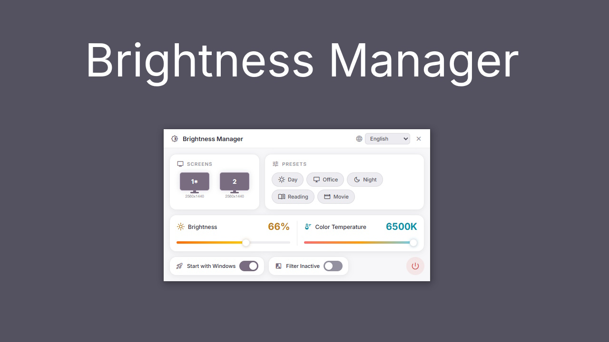

<p align="center">
  
</p>

<p align="center">
  <strong>Multi-monitor brightness & color temperature control for Windows</strong>
</p>

<p align="center">
  
  
  
</p>

<p align="center">
  <a href="#features">Features</a> &bull;
  <a href="#installation">Installation</a> &bull;
  <a href="#development">Development</a> &bull;
  <a href="#languages">Languages</a> &bull;
  <a href="#license">License</a>
</p>

---

> **Windows 10/11 only** — Uses native Win32 APIs for per-monitor overlay rendering and system tray integration.

## Features

- **Multi-monitor support** — Control brightness and color temperature per monitor or all at once
- **5 built-in presets** — Day, Office, Night, Reading, Movie — one click to switch
- **Color temperature filter** — Warm overlay from 1000K to 6500K to reduce blue light
- **System tray integration** — Runs in background, double-click to open, right-click for quick menu
- **Auto-start with Windows** — Optional startup toggle
- **15 languages** — English, Türkçe, Deutsch, Français, Español, Italiano, Português, Русский, 日本語, 한국어, 中文, العربية, हिन्दी, Nederlands, Polski

## Installation

### Download

Download the latest installer from [Releases](https://github.com/Rounted/Brightness-Manager/releases):

| File | Description |
|------|-------------|
| `Brightness-Manager_1.0.0_x64-setup.exe` | NSIS installer (recommended) |
| `Brightness-Manager_1.0.0_x64_en-US.msi` | MSI installer |

### Build from Source

**Requirements:** [Rust](https://rustup.rs/)

```bash
cargo install tauri-cli
cargo tauri build
```

Installers will be generated in `src-tauri/target/release/bundle/`.

## Development

```
Brightness-Manager/
├── src/                    # Web frontend
│   ├── index.html          # Main UI
│   ├── main.js             # App logic
│   ├── lang.js             # Translations (15 languages)
│   ├── overlay.html        # Screen overlay
│   └── styles.css          # Styling
├── src-tauri/
│   └── src/
│       ├── lib.rs          # Tauri commands
│       ├── config.rs       # Config persistence
│       ├── overlay.rs      # Per-monitor overlay windows
│       └── tray.rs         # System tray menu
└── resources/              # App icons
```

### Run in development mode

```bash
cargo tauri dev
```

## Languages

| Language | Code |
|----------|------|
| English | `en` |
| Türkçe | `tr` |
| Deutsch | `de` |
| Français | `fr` |
| Español | `es` |
| Italiano | `it` |
| Português | `pt` |
| Русский | `ru` |
| 日本語 | `ja` |
| 한국어 | `ko` |
| 中文 | `zh` |
| العربية | `ar` |
| हिन्दी | `hi` |
| Nederlands | `nl` |
| Polski | `pl` |

## License

This project is licensed under the [MIT License](LICENSE).
